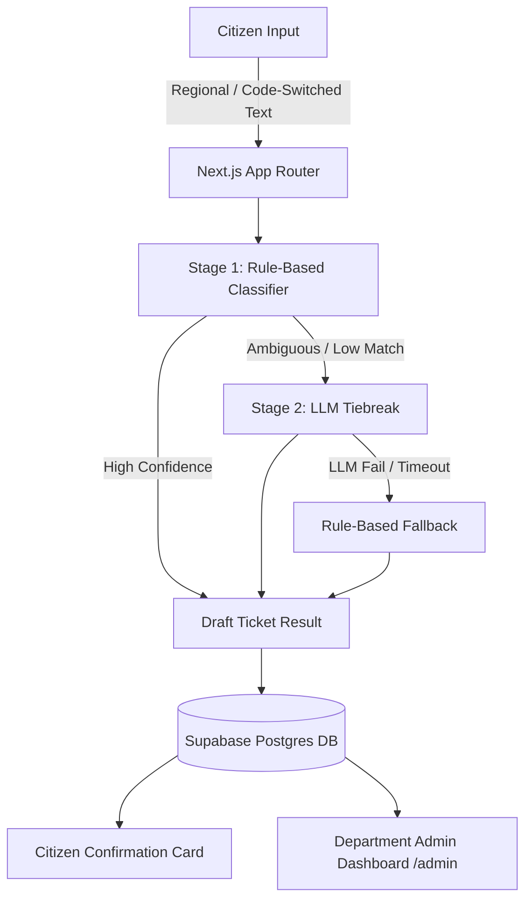

# 🌐 Vernacular Grievance Redressal System

> **MeitY AI Problem Statement Challenge**: An explainable, AI-assisted regional-language grievance classification, routing, and auto-ticket-drafting platform built for Indian Municipal & State Governance.

---

## 📌 Executive Summary

India's rich linguistic diversity means citizens frequently submit public grievances in regional Indian languages (Hindi, Telugu, Tamil, Kannada, Marathi, etc.), code-switched dialects (Hinglish/Teluglish), or local colloquialisms. Traditional keyword routers often fail on dialect variations, while opaque "black-box" LLMs lack the transparency required for government administration.

The **Vernacular Grievance Redressal System** solves this via a **hybrid two-stage explainable classification engine**:
1. **Stage 1 (Deterministic Rule-Based)**: Always runs first, scoring categories against multilingual keyword dictionaries across English, Hindi (Devanagari & Romanized), and Telugu (Telugu script & Romanized). Provides transparent matched-keyword audit logs.
2. **Stage 2 (LLM-Assisted Tiebreak)**: Triggers *only* when keyword scores are ambiguous or no keywords match, resolving complex multi-issue complaints while extracting structured ticket fields (`issue_summary`, `location`, `urgency`, `requested_action`).

---

## ✨ Key Features

- **🌐 Multilingual & Code-Switched Processing**: Recognizes native scripts, Romanized transliterations, code-switching, short 2-word inputs, and long rambling complaints.
- **🔍 100% Explainable Classification**: Every ticket includes a collapsible **"Why this category?"** audit drawer showing classification method (`rule_based` vs `ai_assisted_tiebreak`), matched keywords, candidate rankings, confidence scores, and reasoning.
- **⚠️ Honest Uncertainty UX**: When confidence is below threshold ($<35\%$), the citizen portal automatically displays a **Low-Confidence Uncertainty Alert** with a manual category selector dropdown.
- **📝 Citizen Review & Edit Workflow**: Allows citizens to inspect, edit, or confirm auto-drafted ticket fields prior to final submission.
- **📊 Department Governance Admin Dashboard**: Real-time administrative view at `/admin` listing submitted grievances, grouped by category and department, with status filters (`draft`, `confirmed`, `rejected`).

---

## 🏛️ Supported Departments & Categories

The platform automatically classifies grievances into six core Indian civic departments:

| Category | Department | Key Grievance Topics |
| :--- | :--- | :--- |
| **Water Supply** | Municipal Water Board | Pipeline leaks, dirty/contaminated water, low pressure, water meters, tankers |
| **Electricity** | Electricity Board | Power cuts, outages, transformer sparking, high voltage, billing disputes |
| **Sanitation** | Sanitation Department | Overflowing garbage, clogged drains/sewage, bad smell, mosquitoes, street cleaning |
| **Roads / PWD** | Public Works Department | Potholes, broken roads, street lighting, bridges, pavements, speed breakers |
| **Police** | Police Department | Theft, law and order, noise pollution, safety complaints, neighbor disputes |
| **Revenue / Land Records** | Revenue Department | Property tax, land title verification, patta/chitta, income/caste certificates |

---

## 🛠️ Architecture & Tech Stack



- **Frontend & App Framework**: Next.js 16 (App Router), React 19, TypeScript
- **Styling**: Tailwind CSS (Government Trust-Centric Aesthetic)
- **Database & Backend**: Supabase (PostgreSQL with `@supabase/supabase-js`)
- **AI / LLM Integration**: Anthropic Claude 3 / Google Gemini Flash (Strict JSON Schema Output)

---

## 📂 Project Structure

```text
├── app/
│   ├── page.tsx                    # Citizen Grievance Submission Portal & State Machine
│   ├── admin/page.tsx              # Department Governance Admin Dashboard
│   ├── api/
│   │   ├── grievance/classify/     # POST API: Grievance ingestion & classification
│   │   ├── grievance/confirm/      # POST API: Citizen confirmation & field edit handler
│   │   └── admin/tickets/          # GET API: Admin ticket directory endpoint
├── components/
│   ├── Navbar.tsx                  # Shared Government Header & Portal Switcher
│   └── ConfirmationCard.tsx        # Citizen Review & Explainable Logic Drawer Component
├── lib/
│   ├── categories.ts               # Department definitions & multilingual keyword dictionaries
│   ├── classifier.ts               # Core 2-stage classification & ticket-drafting engine
│   ├── supabase.ts                 # Supabase client initialization & SSL CA configuration
│   └── types.ts                    # TypeScript interfaces & schema payloads
├── supabase/
│   ├── migrations/0001_init.sql    # Database schema (4 tables + RLS policies)
│   └── seed.sql                    # Department category seed data
└── test-data/
    └── edge-case-results.md        # Edge-case audit & hardening report
```

---

## ⚡ Quickstart & Setup Guide

### 1. Prerequisites

- [Node.js](https://nodejs.org/) v18.0 or higher
- [npm](https://www.npmjs.com/) package manager
- A free [Supabase Account](https://supabase.com)

### 2. Clone & Install Dependencies

```bash
git clone https://github.com/YashwanthReddyPuli/Vernacular-grievance-chatbot.git
cd Vernacular-grievance-chatbot
npm install
```

### 3. Environment Variable Setup

Copy `.env.local.example` to `.env.local`:

```bash
cp .env.local.example .env.local
```

Edit `.env.local` with your Supabase credentials (and optional LLM API keys):

```env
# Supabase Configuration
NEXT_PUBLIC_SUPABASE_URL=https://your-project-ref.supabase.co
NEXT_PUBLIC_SUPABASE_ANON_KEY=your-supabase-anon-key-here

# Optional: LLM API Key for Stage 2 AI Tiebreak (Anthropic / Gemini)
ANTHROPIC_API_KEY=your-anthropic-api-key
GEMINI_API_KEY=your-gemini-api-key
```

### 4. Database Setup (Supabase)

1. Open your project in the **Supabase Dashboard** -> **SQL Editor**.
2. Run `supabase/migrations/0001_init.sql` to create tables (`categories`, `grievances`, `tickets`, `confirmations`) and RLS policies.
3. Run `supabase/seed.sql` to populate the 6 initial department categories.

### 5. Run Development Server

```bash
npm run dev
```

- Open **`http://localhost:3000`** for the **Citizen Grievance Submission Portal**.
- Open **`http://localhost:3000/admin`** for the **Department Governance Dashboard**.

---

## 🧪 Testing & Edge Case Verification

Run the built-in classification test suite against regional language test cases:

```bash
npx tsx lib/classifier.test.ts
```

For full edge-case audit details (code-switched inputs, short phrases, rambling text, and low-confidence manual overrides), see [`test-data/edge-case-results.md`](file:///c:/Users/Admin/Desktop/Chatbot/test-data/edge-case-results.md).

---

## 📄 License

Developed for the **MeitY AI Hackathon Challenge** • Open Source under the MIT License.
